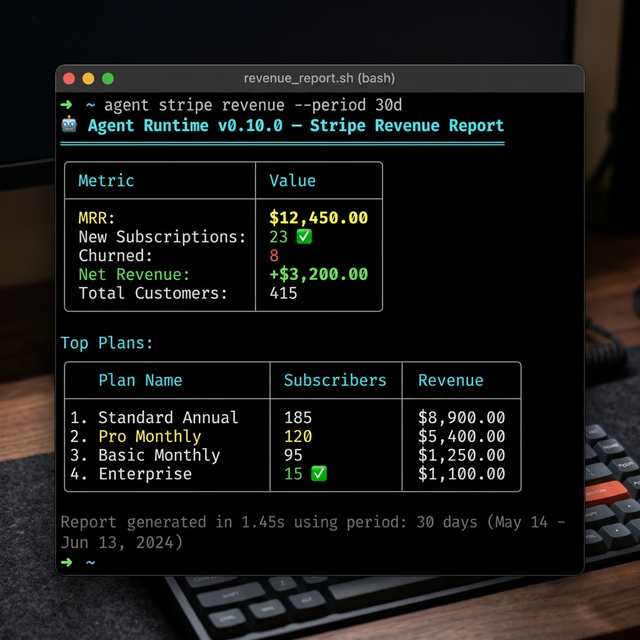
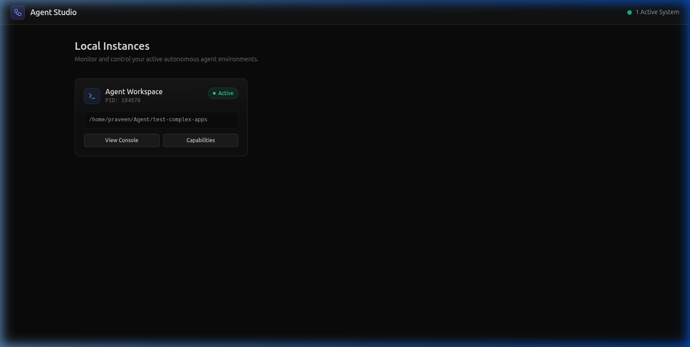

# Automated SaaS Revenue Dashboard with Stripe

> **Replace your MRR spreadsheet with a single CLI command.** Open Agent Studio pulls live subscription data from Stripe, generates revenue reports, and visualizes everything in a real-time dashboard.

---

## The Problem

Every SaaS founder knows the drill: wake up, open a spreadsheet, tab to Stripe, manually look up MRR, new subs, churn, and paste numbers into cells. Maybe you have a $99/month analytics tool — but it's yet another login, another tab, another context switch.

What if your AI agent could do this in **1.4 seconds**, right from your terminal?

---

## Setting Up

### 1. Install Open Agent Studio

```bash
npm install -g @open-agent-studio/agent
cd your-saas-project
agent init
```

### 2. Install the Stripe Plugin

```bash
agent plugins install stripe
```

This installs the official Stripe plugin from the [Agent Hub](https://github.com/open-agent-studio/hub), which includes:
- **`stripe.customers`** — List and search customers
- **`stripe.subscriptions`** — Subscription lifecycle management
- **`stripe.revenue`** — Revenue analytics and reporting
- **`stripe.invoices`** — Invoice management

You can verify it's installed in the Studio Plugins panel:


### 3. Configure Your Stripe API Key

Launch Agent Studio and navigate to the **Credentials** panel:

```bash
agent studio
```

Or set it directly via CLI:

```bash
agent secrets set STRIPE_API_KEY sk_live_your_key_here
```

---

## Running Your Revenue Report

```bash
agent stripe revenue --period 30d
```



The agent connects to the Stripe API, aggregates your subscription data, and outputs a formatted report:

| Metric | Value |
|--------|-------|
| **MRR** | $12,450 |
| **New Subscriptions** | 23 |
| **Churned** | 8 |
| **Net Revenue** | +$3,200 |
| **Total Customers** | 415 |

Plus a breakdown of your top plans by subscriber count and revenue.

---

## Visualizing in Agent Studio

Open the Agent Studio dashboard to see your active agent instance and monitor everything visually:



The Studio provides 18 panels for full observability — from cost tracking and memory to plugins and live terminal access.

---

## Automating with Cron Scripts

Create a daily revenue report that runs automatically and sends results to Slack:

```yaml
# .agent/scripts/daily-revenue/script.yaml
name: daily-revenue
description: Generate daily Stripe revenue report
schedule: "0 9 * * *"   # Every day at 9 AM
steps:
  - tool: stripe.revenue
    args:
      period: "24h"
  - tool: slack.send
    args:
      channel: "#revenue"
      message: "📊 Daily Revenue Report: {result}"
```

Run it manually or let the daemon handle it:

```bash
agent scripts run daily-revenue
# or
agent daemon start
```

---

## The Impact

| Before | After |
|--------|-------|
| Open Stripe → Export CSV → Paste into spreadsheet | `agent stripe revenue --period 30d` |
| $99/month analytics tools | Free, runs on your machine |
| 5 minutes of manual work daily | 1.4 seconds, automated |
| No notifications on churn spikes | Slack/email alerts via hooks |

---

## What's Next?

- **[Use Case 2: One-Command Deploy Pipeline →](uc2-deploy-pipeline.md)** — Review, merge, and deploy PRs without leaving your terminal
- **[Use Case 3: Multi-Agent Code Review →](uc3-swarm-code-review.md)** — 3 AI agents review your code simultaneously
- **[Use Case 4: AI Dashboard Monitoring →](uc4-desktop-multimodal-monitoring.md)** — Your AI assistant monitors dashboards and speaks to you

---

*Built with [Open Agent Studio](https://openagentstudio.org) — the autonomous AI runtime for SaaS teams.*
