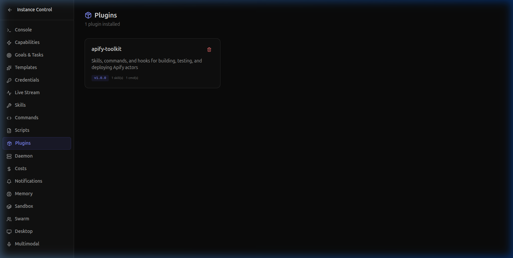
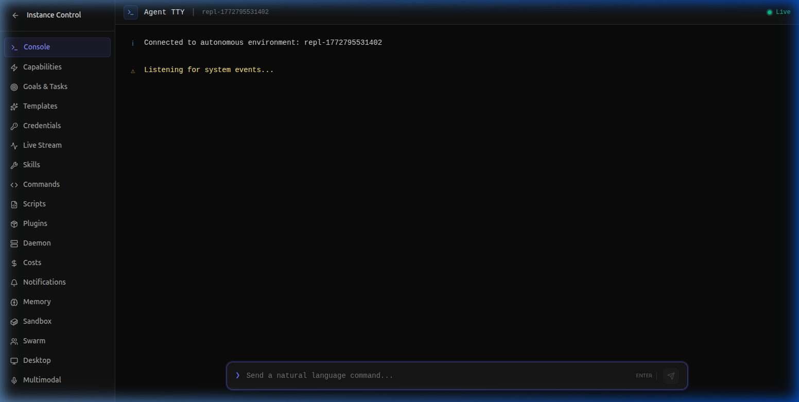

# One-Command GitHub → Vercel Deploy Pipeline

> **Review, merge, and deploy PRs without leaving your terminal.** Open Agent Studio chains GitHub code review, Vercel deployment, and Slack notifications into a single automated pipeline.

---

## The Problem

Deploying a SaaS update typically involves:

1. Open GitHub → Review the PR → Leave comments
2. Switch to terminal → Merge the branch
3. Open Vercel dashboard → Watch the deploy
4. Open Slack → Tell the team it's live

That's **4 context switches** for every single deployment. Multiply by 3-5 deploys per day, and your engineering team is burning hours on ceremony instead of shipping features.

---

## The Solution: A 3-Plugin Pipeline

### Install the Plugins

```bash
agent plugins install github
agent plugins install vercel
agent plugins install slack
```

You can verify all three are loaded in the Studio Plugins panel:



### Configure Your Credentials

```bash
agent secrets set GITHUB_TOKEN ghp_your_token_here
agent secrets set VERCEL_TOKEN your_vercel_token
agent secrets set SLACK_WEBHOOK_URL https://hooks.slack.com/services/...
```

---

## Step 1: Automated PR Review

```bash
agent github review --pr 47 --repo open-agent-studio/webapp
```

The agent reads the PR diff, analyzes code quality, and posts a review:

```
🤖 Agent Runtime v0.10.0 — PR Review

📋 PR #47: feat: add payment flow
   Author: @alex  |  Files Changed: 8  |  +342 / -28

✅ Code Quality
   ├── No unused imports detected
   ├── Error handling present in all async functions
   └── TypeScript strict mode compliant

⚠️  Suggestions
   ├── payment-service.ts:45 — Consider adding retry logic for Stripe API calls
   └── checkout.tsx:89 — Missing loading state for payment button

🔒 Security
   └── No hardcoded secrets or API keys detected

Verdict: ✅ APPROVED (2 minor suggestions)
```

## Step 2: One-Command Deploy

```bash
agent vercel deploy --project webapp --prod
```

```
🤖 Agent Runtime v0.10.0 — Vercel Deployment

🚀 Deploying webapp to production...
   ├── Building...           ████████████░░  78%
   ├── Optimizing assets...  ████████████░░  85%
   ├── Deploying to edge...  ████████████████ 100%
   └── Running health check... ✅ 200 OK

✅ Deployed successfully!
   URL:     https://webapp.vercel.app
   Commit:  8c4f9a  |  Branch: main  |  Time: 34.2s
```

## Step 3: Notify the Team

```bash
agent slack send --channel deployments --message "✅ v2.4.1 deployed to production"
```

---

## Chain Everything into One Script

```yaml
# .agent/scripts/deploy/script.yaml
name: deploy-pipeline
description: Review PR, deploy to Vercel, notify Slack
steps:
  - tool: github.review_pr
    args:
      repo: "open-agent-studio/webapp"
      number: ${PR_NUMBER}

  - tool: github.merge_pr
    args:
      repo: "open-agent-studio/webapp"
      number: ${PR_NUMBER}
    condition: "review.verdict == 'approved'"

  - tool: vercel.deploy
    args:
      project: "webapp"
      production: true

  - tool: slack.send
    args:
      channel: "#deployments"
      message: "✅ PR #${PR_NUMBER} deployed to production in ${deploy.time}"
```

Run it:

```bash
agent scripts run deploy-pipeline --PR_NUMBER=47
```

Monitor everything live in the Agent Studio Console:



---

## The Impact

| Metric | Before | After |
|--------|--------|-------|
| **Context switches** | 4 apps | 1 terminal |
| **Time per deploy** | 12-15 min | 45 seconds |
| **Missed notifications** | Frequent | Zero |
| **Code review turnaround** | Hours | Instant |

---

## What's Next?

- **[← Use Case 1: Stripe Revenue Dashboard](uc1-stripe-revenue-dashboard.md)**
- **[Use Case 3: Multi-Agent Code Review →](uc3-swarm-code-review.md)**
- **[Use Case 4: AI Dashboard Monitoring →](uc4-desktop-multimodal-monitoring.md)**

---

*Built with [Open Agent Studio](https://openagentstudio.org) — the autonomous AI runtime for SaaS teams.*
