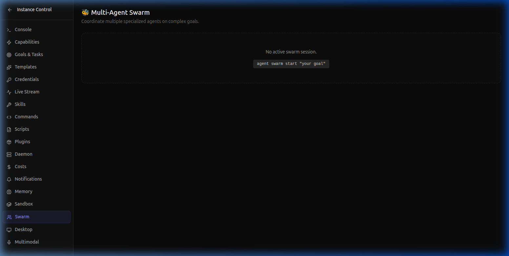

# Multi-Agent Code Review Swarm

> **3 AI agents review your code simultaneously — planner, coder, reviewer.** The Swarm orchestrator decomposes security audits into parallel tasks and produces a comprehensive vulnerability report.

---

## The Problem

Manual code reviews are the #1 bottleneck for engineering velocity. Every PR sits in a queue waiting for a human reviewer who's context-switching between Slack, meetings, and their own code. By the time they review, the author has moved on to something else.

What if you had an **always-available team of 3 specialized AI reviewers** that could audit your entire codebase in seconds?

---

## How the Swarm Works

The Multi-Agent Swarm coordinates 3 specialized agents:

| Agent | Role | What It Does |
|-------|------|-------------|
| 🧠 **Planner** | Strategy | Scans the codebase, identifies critical files, creates a review plan |
| 💻 **Coder** | Analysis | Performs static analysis, checks for anti-patterns, validates logic |
| 🔍 **Reviewer** | Evaluation | Evaluates findings, prioritizes issues, writes the final report |

---

## Setting Up

### Configure the Swarm

Add to your `agent.yaml`:

```yaml
swarm:
  enabled: true
  maxAgents: 5
  model: gpt-4o
  allowDelegation: true
  maxDelegationDepth: 3
  agentTimeout: 120000
```

### Launch a Security Audit

```bash
agent swarm start --goal "Review src/ for security vulnerabilities"
```

```
🤖 Agent Runtime v0.10.0 — Swarm Session

🐝 Swarm initialized: swarm-a4f8b2c1
   Goal: Review src/ for security vulnerabilities

   🧠 Planner Agent (agent-planner-e7a2)  ● DONE
      └── Decomposed into 5 review tasks

   💻 Coder Agent (agent-coder-b3d1)      ● ANALYZING
      ├── Task: Auth Module Scan          ✅ Complete
      ├── Task: SQLi Check                🔄 Running (68%)
      └── Files processed: 14/21

   🔍 Reviewer Agent (agent-reviewer-c9f4) ● WAITING
      └── Pending: Vulnerability Report

   Tasks: 2/5 complete  |  Agents: 3 active  |  Uptime: 12.4s
```

### Monitor in Agent Studio

Open the Swarm panel in Agent Studio to visualize the agents and tasks in real-time:



---

## The Review Report

When the swarm completes, you get a comprehensive report:

```
🐝 Swarm Complete — Security Audit Report

━━━━━━━━━━━━━━━━━━━━━━━━━━
📊 Summary
━━━━━━━━━━━━━━━━━━━━━━━━━━

Files Scanned:    21
Issues Found:     4
Critical:         1  🔴
Warning:          2  🟡
Info:             1  🔵

━━━━━━━━━━━━━━━━━━━━━━━━━━
🔴 CRITICAL: SQL Injection in user-query.ts
━━━━━━━━━━━━━━━━━━━━━━━━━━

  File:  src/db/user-query.ts:34
  Code:  `db.query(\`SELECT * FROM users WHERE id = ${userId}\`)`
  Fix:   Use parameterized queries: db.query('SELECT * FROM users WHERE id = $1', [userId])

━━━━━━━━━━━━━━━━━━━━━━━━━━
🟡 WARNING: Missing Rate Limiting on /api/auth
━━━━━━━━━━━━━━━━━━━━━━━━━━

  File:  src/routes/auth.ts:12
  Issue: Login endpoint has no rate limiting
  Fix:   Add express-rate-limit middleware

━━━━━━━━━━━━━━━━━━━━━━━━━━
🟡 WARNING: Hardcoded CORS Origin
━━━━━━━━━━━━━━━━━━━━━━━━━━

  File:  src/server.ts:8
  Issue: CORS origin set to '*' in production config
  Fix:   Restrict to specific domains

━━━━━━━━━━━━━━━━━━━━━━━━━━

⏱️ Total time: 34.2s  |  Agents: 3  |  Tasks: 5/5 done
```

---

## Automate Weekly Audits

```yaml
# .agent/scripts/security-audit/script.yaml
name: security-audit
description: Weekly automated security review
schedule: "0 6 * * 1"   # Every Monday at 6 AM
steps:
  - tool: swarm.start
    args:
      goal: "Review src/ for security vulnerabilities, outdated dependencies, and exposed secrets"
  - tool: slack.send
    args:
      channel: "#security"
      message: "🔒 Weekly Security Audit Complete: {result.summary}"
```

---

## Why This Matters

| Before | After |
|--------|-------|
| PR reviews wait hours in queue | Instant, 24/7 automated reviews |
| 1 reviewer catches what they can | 3 specialized agents with full coverage |
| Security audits happen quarterly | Automated weekly (or per-commit) |
| Manual vulnerability scanning | AI-powered pattern recognition |

---

## What's Next?

- **[← Use Case 2: Deploy Pipeline](uc2-deploy-pipeline.md)**
- **[Use Case 4: AI Dashboard Monitoring →](uc4-desktop-multimodal-monitoring.md)**

---

*Built with [Open Agent Studio](https://openagentstudio.org) — the autonomous AI runtime for SaaS teams.*
