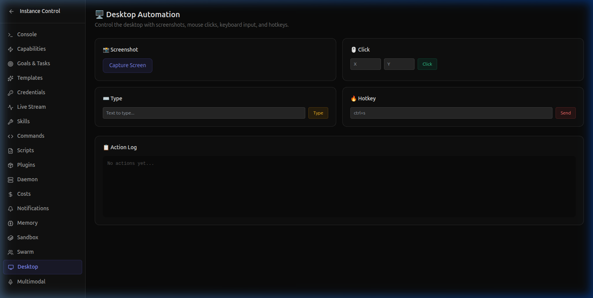
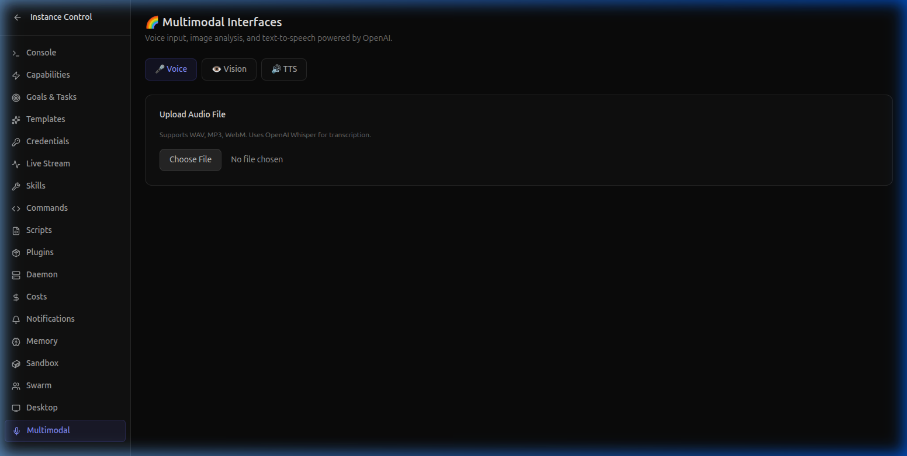

# AI-Powered SaaS Monitoring with Desktop + Multimodal

> **Your AI assistant monitors your dashboards and tells you what's wrong — literally speaks to you.** Combine Desktop Automation screenshots with GPT-4o Vision analysis and Text-to-Speech for hands-free monitoring.

---

## The Problem

You're a SaaS founder. You have Grafana, Datadog, your own admin panel, Stripe… you're drowning in dashboards. You check them 10 times a day, mostly to see "everything is fine." But the one time you don't check, something breaks.

What if an AI agent could **watch your dashboards for you** and **speak up when something goes wrong**?

---

## The Architecture

```
┌─────────────────┐     ┌──────────────────┐     ┌─────────────────┐
│ Desktop Module   │────▶│ Multimodal Vision│────▶│ Multimodal TTS  │
│ Take Screenshot  │     │ Analyze Image    │     │ Speak Summary   │
│ of your dashboard│     │ with GPT-4o      │     │ via OpenAI TTS  │
└─────────────────┘     └──────────────────┘     └─────────────────┘
```

Three modules working together:

1. **Desktop Automation** captures a screenshot of any dashboard
2. **Multimodal Vision** analyzes the screenshot using GPT-4o
3. **Multimodal TTS** converts the analysis into spoken audio

---

## Setting Up

### Configure Multimodal

Add to your `agent.yaml`:

```yaml
desktop:
  enabled: true
  screenshotFormat: png
  actionDelay: 100

multimodal:
  enabled: true
  vision:
    model: gpt-4o
    detail: auto
  tts:
    model: tts-1
    voice: alloy
    format: mp3
```

Set your OpenAI API key:

```bash
agent secrets set OPENAI_API_KEY sk-...
```

---

## Step 1: Capture Your Dashboard

Use the Desktop Automation panel in Agent Studio or the CLI:

```bash
agent desktop screenshot
```



The screenshot is saved locally and ready for analysis.

---

## Step 2: AI Vision Analysis

Feed the screenshot to GPT-4o Vision:

```bash
agent multimodal analyze --image /tmp/agent-desktop/screenshot-latest.png \
  --prompt "Analyze this monitoring dashboard. Report any anomalies, spikes, or concerning trends."
```

```
🤖 Agent Runtime v0.10.0 — Vision Analysis

📸 Analyzing: screenshot-latest.png
🤖 Model: gpt-4o  |  Detail: auto  |  Tokens: 847

━━━━━━━━━━━━━━━━━━━━━━━━━━━━━━━━━━━

🔴 ANOMALY DETECTED

  CPU spike to 94% on web-server-03 at 14:32 UTC.
  Memory usage trending upward — 6.1GB of 8GB used.
  Possible memory leak in worker process.

🟡 WARNINGS

  • Disk usage at 78% on db-primary — approaching threshold
  • Request latency p99 increased from 120ms to 340ms in last hour
  • 3 failed health checks on worker-pool-2

🟢 NORMAL

  • Network throughput stable at 450 Mbps
  • Database connections: 42/100 (healthy)
  • CDN hit rate: 94.2%

━━━━━━━━━━━━━━━━━━━━━━━━━━━━━━━━━━━

Suggested Actions:
  1. Investigate memory leak on web-server-03
  2. Scale disk on db-primary or run cleanup job
  3. Check worker-pool-2 configuration
```

Use the Multimodal panel in Agent Studio for a visual interface:



---

## Step 3: Voice Summary

Have the agent speak the results:

```bash
agent multimodal speak "Critical alert: CPU spike to 94% on web server 3. Memory trending upward with a possible leak. Disk usage at 78% on primary database. Recommend investigating worker processes and scheduling a disk cleanup."
```

```
🤖 Agent Runtime v0.10.0 — Text-to-Speech

🔊 Generating speech...
   Voice: alloy  |  Model: tts-1  |  Format: mp3

✅ Audio saved: /tmp/agent-tts/speech-1709654321.mp3
   Duration: 8.2s
```

The agent generates an MP3 file you can play immediately — or pipe to your speakers for a hands-free experience.

---

## Automate Daily Monitoring

Chain all three steps into an automated script:

```yaml
# .agent/scripts/dashboard-monitor/script.yaml
name: dashboard-monitor
description: Screenshot, analyze, and speak daily dashboard summary
schedule: "0 8,12,17 * * *"   # 8 AM, Noon, 5 PM
steps:
  - tool: desktop.screenshot
    args: {}

  - tool: multimodal.analyze
    args:
      image: "{screenshot.path}"
      prompt: "Analyze this monitoring dashboard. Flag anomalies."

  - tool: multimodal.speak
    args:
      text: "{analysis.summary}"

  - tool: slack.send
    args:
      channel: "#monitoring"
      message: "🖥️ Dashboard Check: {analysis.summary}"
    condition: "analysis.hasAnomalies"
```

```bash
agent daemon start
```

Now the agent checks your dashboards 3 times a day, speaks a summary when something is wrong, and alerts your Slack only when there's an anomaly.

---

## Why This Matters

| Before | After |
|--------|-------|
| Check 5+ dashboards manually, 10x/day | Agent checks automatically 3x/day |
| Stare at graphs looking for anomalies | GPT-4o Vision detects patterns for you |
| Write incident summaries manually | TTS speaks the summary to you |
| Miss critical alerts during meetings | Slack alerts only when anomalies detected |

---

## What's Next?

- **[← Use Case 3: Multi-Agent Code Review](uc3-swarm-code-review.md)**
- **[← Use Case 1: Stripe Revenue Dashboard](uc1-stripe-revenue-dashboard.md)**
- Install Open Agent Studio: `npm install -g @open-agent-studio/agent`

---

*Built with [Open Agent Studio](https://openagentstudio.org) — the autonomous AI runtime for SaaS teams.*
